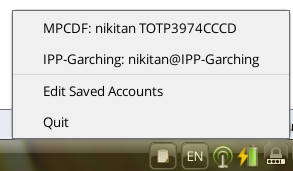

# TrayOTP

TrayOTP is a simple OTP authenticator app that lives in your system tray. Whenever you are prompted for an OTP, you can enter if with just two clicks and a Ctrl+V, no need to reach for your phone and type in the OTP from a phone app. To use, just click on the TrayOTP icon in the system tray, then, in the menu, click on the account (displayed in "Issuer: account_name" format) for which you need an OTP. This will cause the OTP for that account to be copied to the clipboard, so you can paste it into the prompt.

### Dependencies

TrayOTP depends on pyotp, Gtk+ 3.0 and Ayatana-AppIndicator3, as well as the appropriate Python/GI bindings.

### Screenshot

